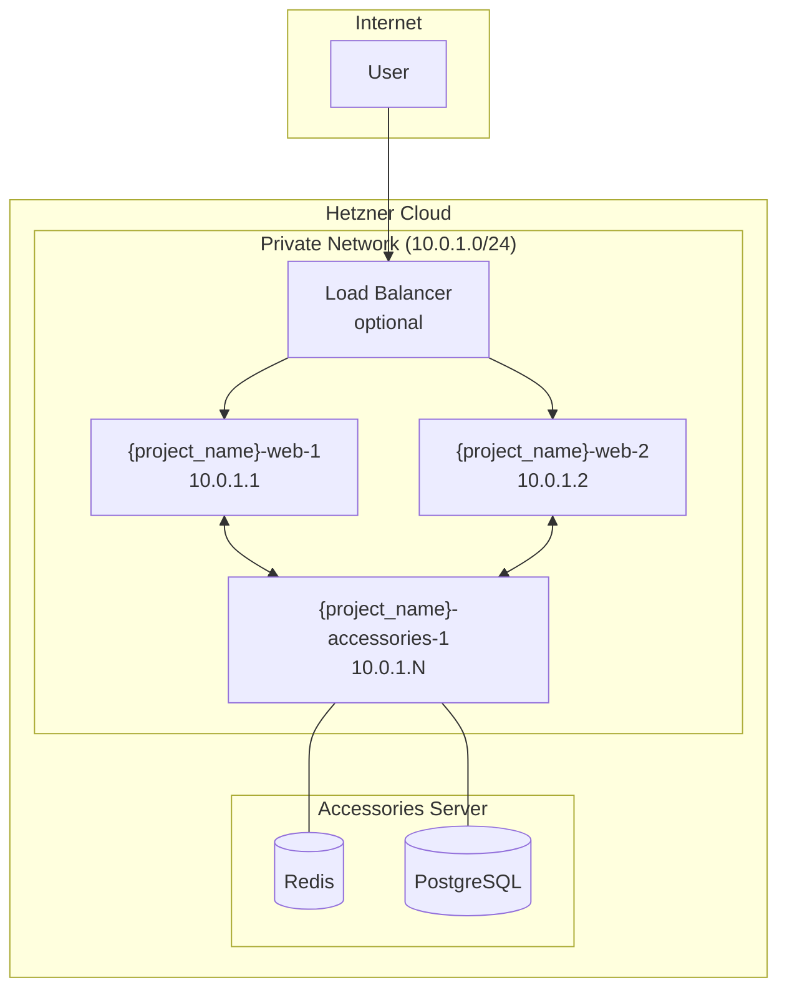
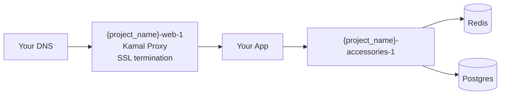
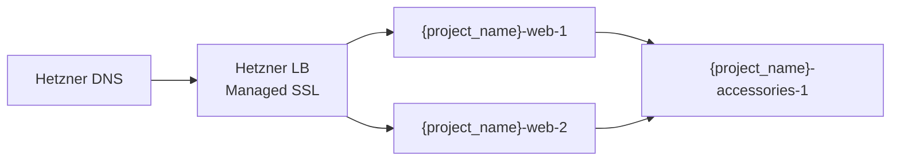

# hetzner-kamal-stack

A generic, reusable Terraform setup for deploying apps to Hetzner Cloud with [Kamal](https://kamal-deploy.org/).

## Architecture



## Deployment Modes

### Simple Mode (Default)
Single web server, Kamal handles SSL via kamal-proxy. Point your DNS manually.



### Production Mode
Multiple web servers with Hetzner Load Balancer and managed SSL certificate.



## Quick Start

### 1. Provision Infrastructure

```bash
cd terraform
cp terraform.tfvars.example terraform.tfvars
# Edit terraform.tfvars with your Hetzner API token

terraform init
terraform apply
```

### 2. Configure Your App

Copy `example/config/deploy.yml` to your app and adjust:
- `service` - your app name
- `image` - your container registry
- `servers` - use the server names from terraform output

### 3. Deploy with Kamal

```bash
kamal setup   # First time: installs Docker
kamal deploy  # Deploy your app
```

## Configuration

### Variables

| Variable | Default | Description |
|----------|---------|-------------|
| `hcloud_token` | required | Hetzner Cloud API token |
| `project_name` | `"app"` | Prefix for all resources |
| `web_count` | `1` | Number of web servers |
| `accessories_count` | `1` | Number of accessories servers |
| `server_type` | `"cax11"` | Hetzner server type |
| `server_location` | `"hel1"` | Hetzner datacenter |

> **Note:** SSH keys are auto-generated and saved to `~/.ssh/{project_name}-hetzner`

### Optional Features

| Variable | Default | Description |
|----------|---------|-------------|
| `enable_lb` | `false` | Enable Hetzner Load Balancer |
| `enable_dns` | `false` | Enable Hetzner DNS management |
| `enable_managed_cert` | `false` | Enable managed SSL cert (requires LB + DNS) |
| `domain` | `""` | Domain name (required if enable_dns) |
| `postgres_volume_size` | `0` | Postgres volume size in GB (0 = disabled) |
| `redis_volume_size` | `0` | Redis volume size in GB (0 = disabled) |
| `ssh_allowed_cidrs` | `["0.0.0.0/0", "::/0"]` | CIDRs allowed to SSH |

### Example Configurations

**Minimal (testing):**
```hcl
hcloud_token = "your-token"
project_name = "myapp"
```

**Production:**
```hcl
hcloud_token         = "your-token"
hetzner_dns_token    = "your-dns-token"
project_name         = "myapp"
web_count            = 2
enable_lb            = true
enable_dns           = true
enable_managed_cert  = true
domain               = "myapp.com"
postgres_volume_size = 20
ssh_allowed_cidrs    = ["YOUR_IP/32"]
```

## Use as a Terraform Module

Reference this repo directly from your app's infrastructure code:

```hcl
module "hetzner_kamal" {
  source = "github.com/flipbitsnotburgers/hetzner-kamal-stack//terraform?ref=master"

  hcloud_token = var.hcloud_token

  project_name      = "myapp"
  web_count         = 1
  accessories_count = 1

  # Optional
  enable_lb           = false
  enable_dns          = false
  enable_managed_cert = false
  hetzner_dns_token   = ""
  domain              = ""
}

output "web_ips" {
  value = module.hetzner_kamal.web_public_ips
}

output "ssh_private_key_path" {
  value = module.hetzner_kamal.ssh_private_key_path
}

output "connection_info" {
  value = module.hetzner_kamal.connection_info
}
```

Then in your app repo:

```bash
cd infra
terraform init
terraform apply
```

Use the output server names in your Kamal config (e.g., `myapp-web-1`, `myapp-accessories-1`).

## Example App

The `example/` directory contains a minimal Go web server with:
- Health check endpoint (`/up`) that pings Redis and Postgres
- Kamal deploy configuration with Redis and Postgres accessories

```bash
cd example
cp .kamal/secrets.example .kamal/secrets
cp .env.example .env
# Edit both files with your credentials and project name
source .env
kamal setup
kamal deploy
```

## Outputs

After `terraform apply`, you'll get:

- `web_servers` - Web server IPs (public and private)
- `accessories_servers` - Accessories server IPs
- `web_public_ips` - List of web server public IPs for DNS
- `lb_ipv4` - Load balancer IP (if enabled)
- `ssh_private_key_path` - Path to generated SSH private key
- `ssh_public_key_path` - Path to generated SSH public key
- `ssh_public_key` - SSH public key content
- `ssh_config_path` - Path to generated SSH config
- `connection_info` - Quick reference for connecting

## SSH Access

Terraform automatically:
1. Generates an ED25519 SSH key pair
2. Saves private key to `~/.ssh/{project_name}-hetzner`
3. Saves public key to `~/.ssh/{project_name}-hetzner.pub`
4. Uploads public key to Hetzner
5. Creates SSH config at `~/.ssh/config.d/{project_name}-hetzner`

Ensure your `~/.ssh/config` includes:
```
Include config.d/*
```

Then connect with:
```bash
ssh {project_name}-web-1
ssh {project_name}-accessories-1
```

## License

MIT
